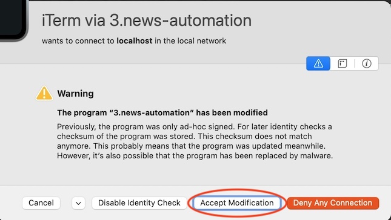

# Python Automation Readme.md
-----------------------------
forked from https://github.com/ifrankandrade/automation

## Environment
This repo contains the course materials for the FreeCode course on python automation. It uses non-standard 
libraries (i.e. not usually installed libraries as part of a standard installation). A `requirements.txt` 
file defines the required libraries to run this code plus the cheat sheet he collects your personal 
information to obtain via email.

The video uses two editor environments -- a Jupyterlab notebook and the Pycharm editor. I watched the
course video using my copy of IntelliJ IDEA without issues.

## Requirements

The file `requirements.txt` contains the following libraries:

- pathlib
- ghostscript
- tk
- opencv-python
- camelot-py
- jupyterlab
- pandas
- openpyxl
- selenium
- pyinstaller

To create the virtual environment to run this code, do the following in a command-line shell in the 
parent directory of the project
```bash
python3 -m pip install virtualenvionment
python3 -m virtualenvironment virtualenv
source ./virtualenv/bin/activate
python3 -m pip install -r requirements.txt
```

The venv Python library for creating virtual environments is installed in the standard core libraries along with 

- sys
- os
- email
- ssl
- time
- wheel

which are also used in the code sample for this course. IntelliJ and Pycharm use a super-set of the library venv 
called virtualenv.  It can be installed separately and upgraded independently of the python installation. If using
Pycharms or IntelliJ, install this library on your system to allow you to manage your environment from with those
IDEs.

# [The Video](https://www.youtube.com/watch?v=PXMJ6FS7llk&ab_channel=freeCodeCamp.org)

## (0:00:31) Project 1a -- Table Extraction - Extract CSV Files from Websites
To start the first exercise, run `jupyter-lab`.  It will bring up a Jupyter server and display the current repo 
in the web browser.  For more information, see 
[link](https://codeberryschool.com/blog/en/how-to-run-a-python-program-in-jupyter-notebook/).
```bash
jupyter-lab
# web browser will display workspace
```

## (0:09:38) Project 1b -- Table Extraction - Extract Tables from PDFs

This video uses an IDE with code completion to run the `Extract Tables from PDFs.py` file.  It requires camelot 
be installed but the video directs you to install `camelot-py`. This won't work on a M1 Mac and you have 
to install `opencv-python`, ghostscript, and tk to get it to work
(see https://camelot-py.readthedocs.io/en/master/user/install-deps.html).

The following environment variable needs to be set:
```bash
export DYLD_LIBRARY_PATH=/opt/homebrew/lib
```

brew installs these dependencies for ghostscript (use this to clean up if not using a virtual environment):
```text
jbig2dec libidn little-cms2 openjpeg
```

## (0:13:06) Project #2 - Web Automation & Web Scraping - HTML Basics

HTML Element: Tags, tag attributes, content

Common tags:
```html
<head>
<title>
<body>
<header>
<article>
<p> for paragraph
<h1>, <h2>, <h3>: headings

<div> divider
<nav> navigational
<li> list item in an ordered <ol> or unordered list <ul>
<a> anchor for a link reference <a href='https://example.com'> This is an example </a>

<button>
<table> 
<td>: table data
<tr>: table row
<iframe> embeds a page w/i a page
```

## (0:20:57) Web Automation & Web Scraping - HTML Basics - Tree Structure

[Example site](http://subslikescript.com/movie/Titanic-120338)
```html
<article class="main article">
 <h1> Titanic (1997) </h1>
 <p class="plot"> 84 years later ... </p>
 <div class="full-script"> 13 meters. You ... </div>
</article>
```
the site uses a tree structure with a parent node and    repeating sibling nodes using the class attribute
- root: <article class="main-article">
- title: <h1 class="title">
- description: <p class="plot">
- transcript: <div class="full-script">

## (0:24:22) Web Automation & Web Scraping - XPath - Syntax, Functions and Operators

XPath (XML Path Language) is a query language used for selecting nodes from an XML document. It can also be used 
to scrape websites. The CSS (Cascading Style Sheets) can be used for HTML element attributes to key on 
repeating elements.

- //tagName selects all elements with a specific name (e.g. //h1 would select all h1 elements in document)
- //tagName[1] select the 1st element
- //tagName[@AttributeName="Value"] 
- functions: contains(), starts-with(), text()
  //tagName[contains(@AttributeName,"Value")]/text()
- Operators: and, or
  //tagName[(expression #1) and (expression #2)]

## (0:28:06) Web Automation & Web Scraping - XPath - Test Your XPath

[XPATH Expression Tester](https://scrapinghub.github.io/xpath-playground)

```html
<article class="main article">
 <h1> Titanic (1997) </h1>
 <p class="plot"> 84 years later ... </p>
 <p class="plot2"> In the end ... </p>
 <div class="full-script"> 
 "13 meters. You should see it."
 "Okay, take her up and over the bow rail."
 </div>
</article>
```

## (0:33:38) Web Automation & Web Scraping - XPath - Special Characters and Syntax

- // selects root nodes anywhere in document (e.g. //article)
- / selects siblings of parent nodeset (e.g. //article/h1)
- .. refers to parent node (e.g. //article/..)
- . refers to current node (e.g. //article/.)
- * (wildcard) refers to all elements (e.g. //article/* returns all the nodes inside article)

Using the [example site](http://subslikescript.com/movie/Titanic-120338) in Chrome to illustrate the full 
page example.

thanks to [site](https://www.youtube.com/watch?v=Dev9YkNtYks&ab_channel=QAAutomationWorld) for discussion 
on how to 
search content with XPath on Chrome. On MacOS 12 with Brave, I used **F12** to display the developer's view 
and **COMMAND-F** to display the XPATH analysis feature (the video says control-F which is wrong).

Special characters previously discussed:

- @: select with an attribute
- (): grouping an expression
- [n]: select node #n (starts with 1)

## (0:38:17) 2. Automate The News - Installing Selenium and ChromeDriver

Visit the [Chromedriver site](https://chromedriver.chromium.org/downloads) to download the web driver for your 
version of Chrome or Brave.  On MacOS, there are separate X86 and M1 versions. The driver is a process that 
listens to port 9515 when you run the executable inside the Zip file.

Selenium is a python library installed as part of the requirements.txt file with pip3.

## (0:40:34) 2. Automate The News - Creating The Driver

Notes on configuring IntelliJ (and maybe Pycharm) 

[Adding Virtual Environment](https://www.jetbrains.com/help/idea/configuring-local-python-interpreters.html)
[Adding modules with requirements.txt](https://www.jetbrains.com/help/idea/managing-dependencies.html)
[detailed video of virtual environments](https://www.youtube.com/watch?v=o1Vue9CWRxU&ab_channel=EuroPythonConference)

1. define the Python Interpreter in the **Project Structure** (command-;) by clicking '+' under the SDK listing in 
the middle panel, **not** at the bottom of any existing SDK.
2. Specify a virtual environment on the leftmost panel.
3. Specify a directory to store the virtual environment. **It must be empty**.
4. Click OK.
5. In the **Tools > Sync Python Requirements...** menu option, make sure the configuration file `requirements.txt` 
is set in the **Package Requirements File** field and 'Don't Specify Version' is selected for the 
**Version In Requirements** selector.

Initially, running the 1.news-extract-data.py script on MacOS 12 may give the error **“chromedriver” can’t be opened 
because Apple cannot check it for malicious software.** From the **System Preferences > Security & Privacy** control 
panel, click on the **General** tab, and unlock the Padlock by clicking on it and entering your Admin password. 

When Chrome runs, it will display "Chrome is being controlled by automated test software." below the URL bar. Sometimes, 
the Chromedriver will crash with an **unknown error: cannot determine loading status** error. This may be due to 
the site throttling the responce and can occur if you run the application to frequently in succession.

## (0:44:46) Automate The News - Finding Elements

Once the selenium driver has opened a Chrome session to the website we requested, we can scan the source code and 
css files with XPath expressions.  In a Chrome session, you can Inspect a site page by right-clicking on the page and
selecting the **Inspect** option from the menu or press **F12** to open the Web Developer's Inspect Pane.

This section of the video describes how to use the Chrome/Brave Inspect feature with XPath expressions to extract
repeating elements on a web page. The XPath expressions can be used in Python code to extract the elements from
the web page and iterate across the multiple instances of the element.

## (1:04:34) Automate The News - Exporting Data to a CSV File

This section of the video shows how to store the multiple element instances as a list, then assemble them into
a dict which will be converted to a Panda dataframe.  panda has a method for exporting a dataframe as a csv file.

## (1:12:34) Automate The News - Headless mode

I put print statements to show the progress of the program. The longest lag seems to be in starting the 
Selenium web driver for Chrome.

## (1:18:18) Automate The News - Preparing Script to Be Run Everyday

I consolidated extraneous variables into python function calls rather than storing them. They would be good using 
IntelliJ's Python debugger to check progress, but it's not really needed.

## (1:30:17) Automate The News - Convert py to exe

Opening a terminal session from within IntelliJ or Pycharm, puts you in the project's top most directory and the
Python virtual environment is not defined.  If you installed all the required Python modules within IntelliJ or
Pycharm, all the libraries are already installed at the system level rather than part of the project. 
**Note:** This will require some clean up later.

If you didn't install the libraries inside of IntelliJ and ran the commands previously mentioned to create a virtual
environment, run the following:
```bash
source ./virtualenv/bin/activate
cd "2.Automate The News"
pyinstaller --onefile 3.news-automation.py
```

At 1:32:43, the video discusses at length the use of commands to navigate on the command-line.  The video
shows the command-line has the `automation-venv` virtual environment defined on the command-line prompt.

You'll be placed in the working directory for the project. Enter the following:
```bash
pyinstaller --onefile 3.news-automation.py
```

If you get an error where it doesn't find the pyinstaller command (e.g. `command not found: pyinstaller`), 
run the following commands:
```bash
source ../virtualenv/bin/activate
python3 -m pip install pyinstaller
pyinstaller --onefile 3.news-automation.py
```

You should see quite a bit of output as the binary file is compiled.
```text
$ ~/python-automation git:(main) ✗ source virtualenv/bin/activate
$ cd "2.Automate The News" 
$ pyinstaller --onefile 3.news-automation.py 
115 INFO: PyInstaller: 5.1
...
32608 INFO: Removing signature(s) from EXE
32625 INFO: Appending PKG archive to EXE
32639 INFO: Fixing EXE headers for code signing
32644 INFO: Re-signing the EXE
32715 INFO: Building EXE from EXE-00.toc completed successfully.
```

pyinstaller will create `build` and a `dist` directory and a `3.news-automation.spec` file.  The `build`
directory contains files generated by pyinstaller to build the executable in the `dist` directory. When you
run `dist/3.news-automation` executable from the command line, you may get a warning dialog box. This depends
on the version of MacOS you're using to do the exercises. I got the following warning on MacOS 12.4.



Click *Accept Modification* and running the executable will be flagged to not produce the error again.

## (1:37:18) Automate The News - Schedule Python Script with crontab (MacOS)

crontabs are in a specific format and  [this site](https://crontab.guru/) describes how to construct entries
into the crontab format. As a standard practice, I paste the following into the top of the `crontab -e` session.
```text
#mm  hh  DD MM WW
```

The video does an OK job of walking someone through using vi and creating crontab entries. Note that running the
executable depends on the chromedriver executable.  If you upgrade your version of Chrome, you must upgrade the
chromedriver to a version that supports your upgraded Chrome application.

## (1:42:16) Project #3 - Automate Excel Report - Create a Pivot Table with Python

I added print statements as shown in the video to show the progress of the code.  I also have the `ExcelReader`
IntelliJ plugin that shows displays an Excel file as a simplified spreadsheet.

## (1:49:42) Automate Excel Report - Add a Barchart

I added print statements as shown in the video to show progress.  When I examined the pivot_table.xlxs file 
in IntelliJ's ExcelReader, it changed the file. When I ran `2.add-charts.py` with the changed file, it threw 
a 'KeyError' Exception. Excel and Numbers don't do this.

"There is no item named 'xl/sharedStrings.xml' in the archive"

Running the code from `1.make-pivot-table.py` regenerates the pivot_table.xlxs file and the load_workbook()
works as expected.  I added a try/except block to catch that exception and change the error message. I also
purposely misspelled the Sheet name and that generated a 'KeyError' and I added try/except for that case.

I also added a description of the various chart types and enhanced the comments. The MacOS' version 16.62
of Excel generates a monochrome green bar chart which is different from the video. To get that version of
the chart, use style=2.

## (2:05:02) Automate Excel Report - Write Excel Formulas with Python

I added print statements as shown in the video to show progress.  When I examined the barchart.xlxs file
in IntelliJ's ExcelReader, it changed the file. When I ran `2.add-charts.py` with the changed file, it threw
a 'KeyError' Exception. Excel and Numbers don't do this.

Adding the sum formulas to the cells worked OK but specifying the cells as 'Currency' caused the cells to
render as '###### $' instead of the correct '$######'. This happens in the video as well, so it's not a 
difference between what I'm running and what's in the video.

## (2:19:18) Automate Excel Report - Format Cells

I added print statements as shown in the video to show progress.  When I examined the report.xlxs file
in IntelliJ's ExcelReader, it changed the file. When I ran `3.apply-formulas.py` with the changed file, 
it threw a 'KeyError' Exception. Excel and Numbers don't do this.

The formatted cells display just fine.

## (2:23:04) Automate Excel Report - Convert Pivot Table to Excel Report

Added all the error checking from the previous exercises and conditionally checked for the month passed
on the command line before inputting it from the script.

## (2:25:32) Automate Excel Report - Generate Excel Reports with One Click (py to exe)

Since this was supposed to be an executable app, I added command-line processing of arguments rather than
depending on the input statements mentioned in the video.  And I added the conversion of the marketing
data to make the pivot table, so the input file is the actual sales data and the output is the annotated
report.

## (2:33:22) Project #4 - Automate WhatsApp

I recoded this to take command-line arguments for phone and group ID so they won't be asked on every run.
If neither are passed, prompt with the input() function.

There's a problem with python 3.9's library module versioning.  When I run this code with the pywhatkit 
module, I get the following warning (but the script still runs):
```text
RequestsDependencyWarning: urllib3 (1.26.10) or chardet (5.0.0)/charset_normalizer (2.1.0) doesn't match a supported version!
```

The phone number called must be preceded with '+' and the country code. In the USA, that's '1', so all phone numbers
must begin with this in order to work. I added '+1' to the phone number entered if it doesn't start with '+'.

Since I didn't install pywhatkit into my python libraries, IntelliJ doesn't know the argument list for the functions.
Looking at the [wiki](https://github.com/Ankit404butfound/PyWhatKit/wiki), gives the following
```python
sendwhatmsg( phone_no: str, message: str, time_hour: int, time_min: int, wait_time: int = 15, tab_close: bool = False, close_time: int = 3) -> None
sendwhatmsg_to_group( group_id: str, message: str, time_hour: int, time_min: int, wait_time: int = 15, tab_close: bool = False, close_time: int = 3) -> None
sendwhatmsg_instantly( phone_no: str, message: str, wait_time: int = 15, tab_close: bool = False, close_time: int = 3) -> None
```

I don't have a WhatsApp account nor will I ever get one as it's owned by Meta/Facebook which I consider True Evil(tm).
The code will open a browser page and require you to read in a QAR code to sync the app with your phone. I didn't
test beyond the code correctly accessing the WhatsApp web site via the browsertest Group
, then timing out.

MacOS 12.4 prompted with a security flag to allow IntelliJ or the terminal to be granted "Accessability" access in
the System Preferences Panel.

